---
## Front matter
title: "Лабораторная работа №1"
subtitle: "Математическое моделирование"
author: "Серёгина Ирина Андреевна"

## Generic otions
lang: ru-RU
toc-title: "Содержание"

## Bibliography
bibliography: bib/cite.bib
csl: pandoc/csl/gost-r-7-0-5-2008-numeric.csl

## Pdf output format
toc: true # Table of contents
toc-depth: 2
lof: true # List of figures
lot: true # List of tables
fontsize: 12pt
linestretch: 1.5
papersize: a4
documentclass: scrreprt
## I18n polyglossia
polyglossia-lang:
  name: russian
  options:
	- spelling=modern
	- babelshorthands=true
polyglossia-otherlangs:
  name: english
## I18n babel
babel-lang: russian
babel-otherlangs: english
## Fonts
mainfont: IBM Plex Serif
romanfont: IBM Plex Serif
sansfont: IBM Plex Sans
monofont: IBM Plex Mono
mathfont: STIX Two Math
mainfontoptions: Ligatures=Common,Ligatures=TeX,Scale=0.94
romanfontoptions: Ligatures=Common,Ligatures=TeX,Scale=0.94
sansfontoptions: Ligatures=Common,Ligatures=TeX,Scale=MatchLowercase,Scale=0.94
monofontoptions: Scale=MatchLowercase,Scale=0.94,FakeStretch=0.9
mathfontoptions:
## Biblatex
biblatex: true
biblio-style: "gost-numeric"
biblatexoptions:
  - parentracker=true
  - backend=biber
  - hyperref=auto
  - language=auto
  - autolang=other*
  - citestyle=gost-numeric
## Pandoc-crossref LaTeX customization
figureTitle: "Рис."
tableTitle: "Таблица"
listingTitle: "Листинг"
lofTitle: "Список иллюстраций"
lotTitle: "Список таблиц"
lolTitle: "Листинги"
## Misc options
indent: true
header-includes:
  - \usepackage{indentfirst}
  - \usepackage{float} # keep figures where there are in the text
  - \floatplacement{figure}{H} # keep figures where there are in the text
---

# Цель работы

Ознакомление и приобретение практических навыков работы с git.

# Задание

1. Выполнить задания из файла к лабораторной работе
2. Выполнить отчёт к лабораторной работе в Markdown

# Выполнение лабораторной работы

Сначала устанавливаю параметры установки окончаний строк и отображения unicode (рис. [-@fig:001]).

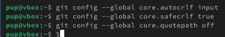{#fig:001 width=70%}

Начинаю работу в пустом рабочем каталоге с создания пустого каталога с именем
hello, затем вхожу в него и создайте там файл с именем hello.html (рис. [-@fig:002]).

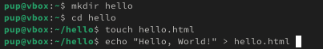{#fig:002 width=70%}

Создаю репозиторий из этого каталога (рис. [-@fig:003]).

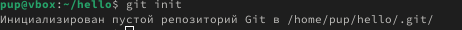{#fig:003 width=70%}

Добавляю файл в репозиторий и проверяю текущее состояние репозитория. Команда проверки состояния сообщает, что коммитить нечего. Это означает,
что в репозитории хранится текущее состояние рабочего каталога, и нет никаких
изменений, ожидающих записи (рис. [-@fig:004]).

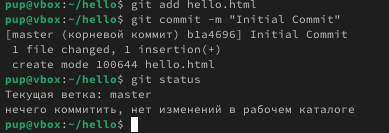{#fig:004 width=70%}

Изменяю содержимое файла, добавляю к нему html тэги "<h1>Hello, World!</h1>". После проверки состояния рабочего каталога видим, что файл был изменен, но в репозитории изменения не были зафиксированы (рис. [-@fig:005]).

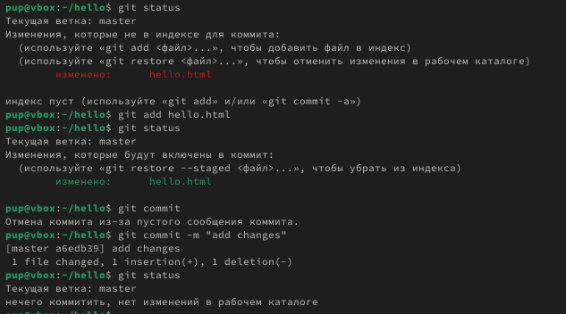{#fig:005 width=70%}

Индексирую изменения и проверяю состояние, после этого комичу изменения (рис. [-@fig:006]).

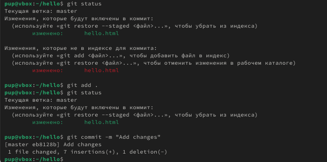{#fig:006 width=70%}

Получаю список произведенных изменений, смотрю на однострочный формат и документацию (рис. [-@fig:007]).

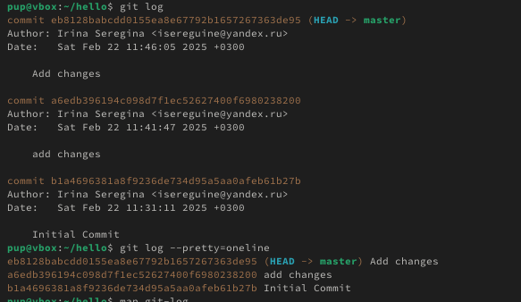{#fig:007 width=70%}

Использую хэш для первого коммита. Смотрю содержимое файла для более старой версии и для той, что есть сейчас (рис. [-@fig:008]).

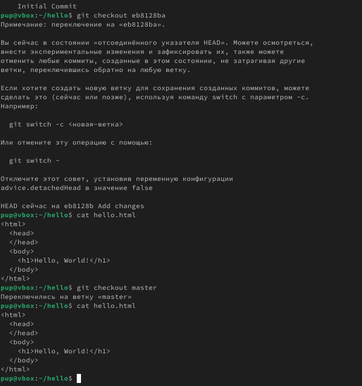{#fig:008 width=70%}

Создаю тэг для текущей версии страницы (рис. [-@fig:009]).

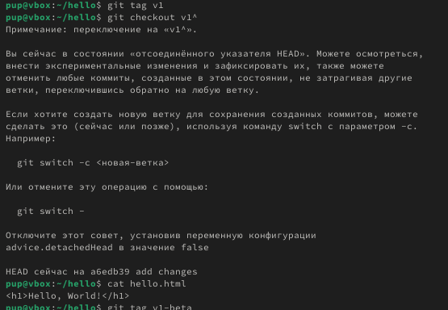{#fig:009 width=70%}

Перехожу в рабочий каталог (рис. [-@fig:010]).

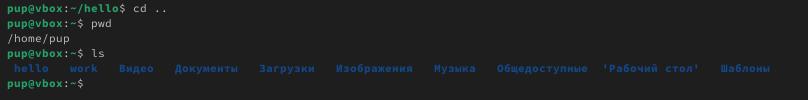{#fig:010 width=70%}

Клонирую ранее созданный репозиторий (рис. [-@fig:011]).

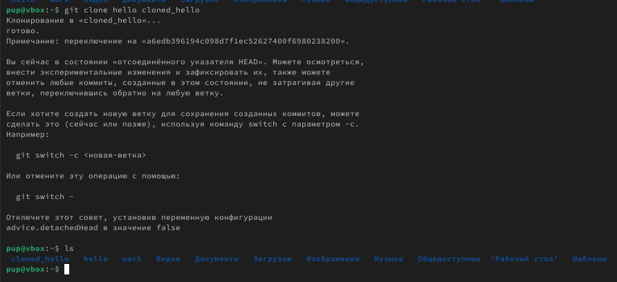{#fig:011 width=70%}

Вывожу список файлов на верхнем уровне оригинального репозитория, смотрю на список коммитов в новый репозиторий (рис. [-@fig:012]).

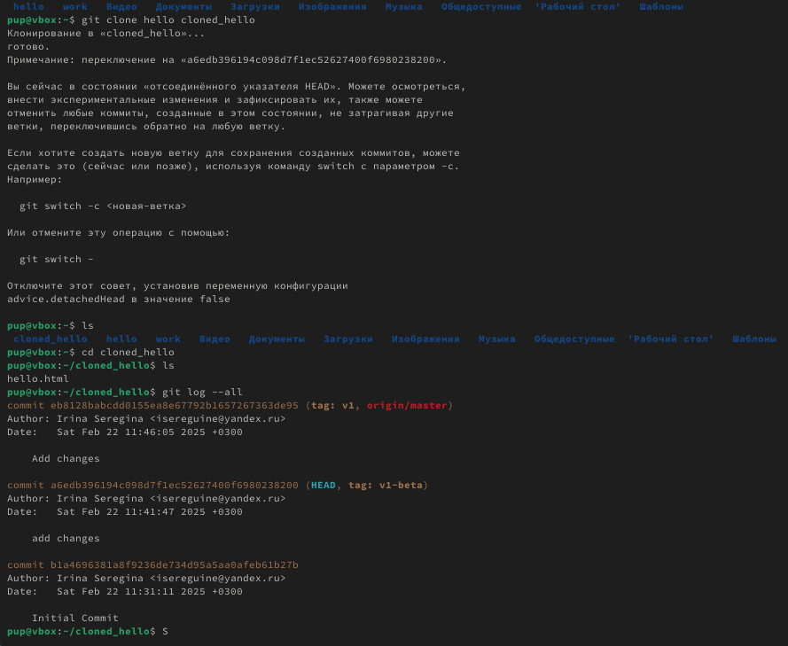{#fig:012 width=70%}

Клонированный репозиторий знает об имени по умолчанию
удаленного репозитория (рис. [-@fig:013]).

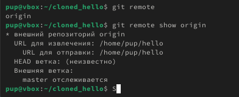{#fig:013 width=70%}

Перехожу в изначальный репозиторий (рис. [-@fig:014]).

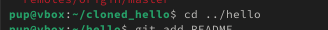{#fig:014 width=70%}

Изменяю файл README.md (рис. [-@fig:015]).

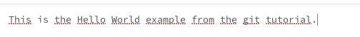{#fig:015 width=70%}

Добавляю изменение и делаю коммит (рис. [-@fig:016]).

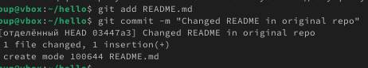{#fig:016 width=70%}

Извлекаю изменения из удаленного репозитория (рис. [-@fig:017]).

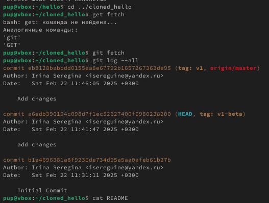{#fig:017 width=70%}

Сливаю извлеченные изменения в локальную ветку master (рис. [-@fig:018]).

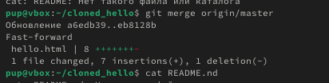{#fig:018 width=70%}

Создаю чистый репозиторий (рис. [-@fig:019]).

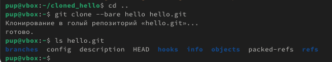{#fig:019 width=70%}

Добавляю удаленный репозиторий (рис. [-@fig:020]).

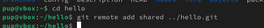{#fig:020 width=70%}

Вношу изменения в файл (рис. [-@fig:021]).

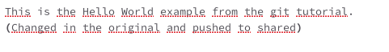{#fig:021 width=70%}

Отправляю изменения в общий репозиторий, после этого извлекаю из него изменения (рис. [-@fig:022]).

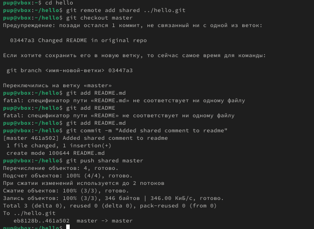{#fig:022 width=70%}

# Выводы

Я ознакомилась и приобрела практические навыки работы с git.

